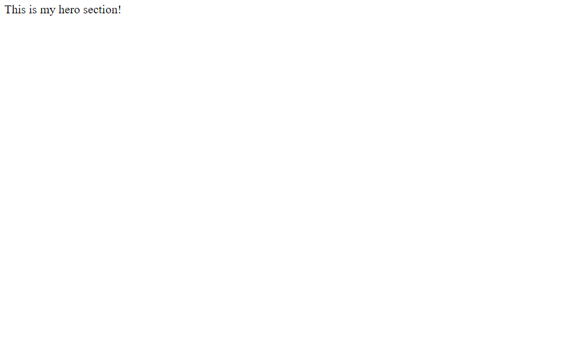
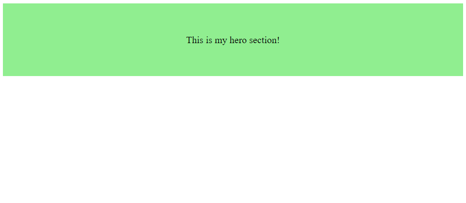
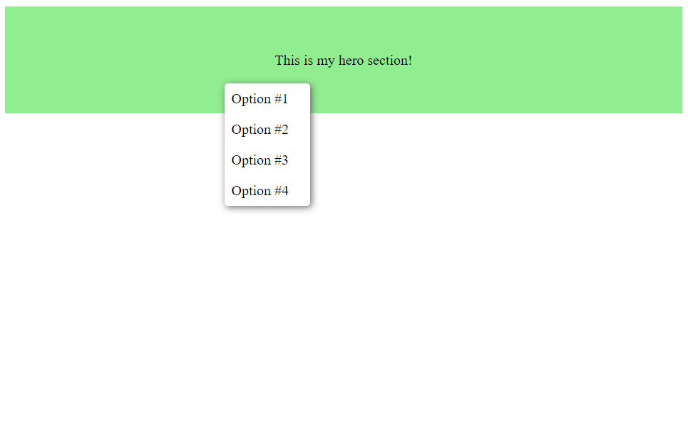
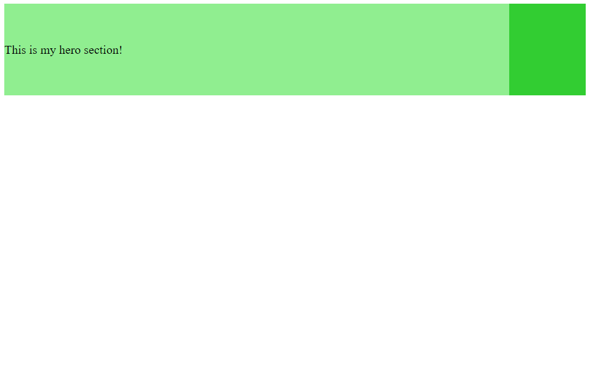
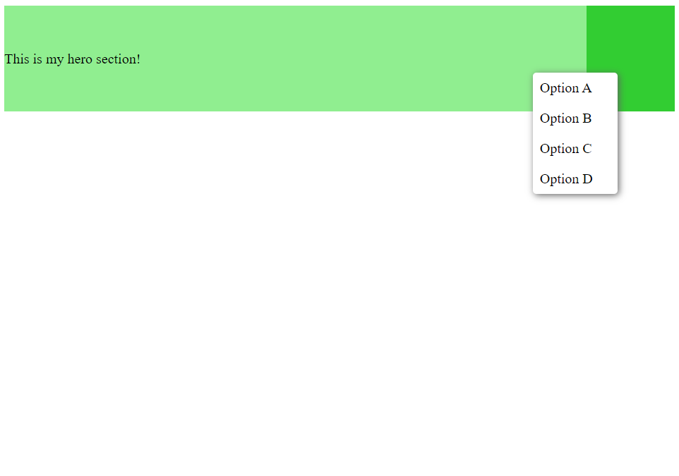

# react-context-menu basics

In this tutorial I will show you how to use the `react-context-menu` library

## Setup

Before we start, you should have a react project set up. I won't be going into
how to set up a React project, but you can check out 
[create-react-app](https://create-react-app.dev/), which is a popular tool for 
quickly setting up a React project.

Once you have a React app set up, install this library by running 
`npm install @printy/react-context-menu`

This tutorial shows you how to use the library with TypeScript, but the process
is pretty much the same for a JS project, minus the types.

## Using the library

Using this library is very easy. Let's assume that you have a component called
`HeroSection` which is inside the `App` component.

*HeroSection.tsx*
```
export default function HeroSection() {
    return (
        <section>
            This is my hero section!
        </section>
    )
}
```

*App.tsx*
```
import HeroSection from './HeroSection.tsx'

export default function App() {
    <div>
        <HeroSection />
    </div>
}
```



Currently the hero section is very small in height and not distinguishable 
because there is not much content in it and no styles. Let's apply some styles
to it to make it more distinguishable

*HeroSection.tsx*
```
export default function HeroSection() {
    return (
        <section
            style={{
                display: 'flex',
                height: 120,
                backgroundColor: 'lightgreen',
                alignItems: 'center',
                justifyContent: 'center'
            }}
        >
            This is my hero section!
        </section>
    )
}
```



<sub>**NOTE:** Generally, it is considered bad practice to use inline CSS styles, but 
I've done so here for the sake of simplicity. Usually you would create a separate
CSS file and apply the style on the component using the `className` prop<sub>

Okay, now that we have our hero section, we can create a context menu for it by 
using our library

First of all, import the `<ContextMenuProvider/>` and add it somewhere at the top
level of your app. 

*App.tsx*
```
import HeroSection from './HeroSection.tsx'
import { ContextMenuProvider } from '@printy/react-context-menu'

export default function App() {
    <div>
        <HeroSection />
    </div>
}
```

The [ContextMenuProvider](#) component manages the context menus and makes sure there
is only one context menu open at a time.

Next, let's import the `<ContextMenuContainer/>` and `<Menu/>` components at the top of *HeroSection.tsx*

*HeroSection.tsx*
```
//Somewhere at the top of the file
import { Menu, ContextMenuContainer } from '@printy/react-context-menu'
/*...*/
```

Next, add the `<ContextMenuContainer/>` component inside the `<section>` element
and move the hero text inside the newly added component

*HeroSection.tsx*
```
/* ... */
<section
    style={{
        /* ... */
    }}
>
    <ContextMenuContainer
        style={{
            display: 'flex',
            alignItems: 'center',
            justifyContent: 'center'
        }}
    >
        This is my hero section!
    </ContextMenuContainer>
</section>
/* ... */
```

The (<ContextMenuContainer/>)[#] Defines the clickable area where right-clicking
will invoke the context menu

At this point, if you right click the section, nothing will happen. That's because
we haven't specfied a `menu` prop for the `<ContextMenuContainer/>`, so let's go
ahead and do that. In this tutorial we will be using the `<Menu/>` component that
comes along with the package. 

*HeroSection.tsx*
```
<ContextMenuContainer
    style={{
        /* ... */
    }}
    menu={
        <Menu
            options={[
                {
                    label: 'Option #1'
                },
                {
                    label: 'Option #2'
                },
                {
                    label: 'Option #3'
                },
                {
                    label: 'Option #4'
                }
            ]}
        />
    }
>
```

[Full documentation on the menu component](#) 

If you want to create and use a custom menu component,
see the [tutorial on how to make a custom menu component](#)

Now if you right click the hero section, the context menu will appear. Yay! We did it!



Notice that if you right click anywhere else on the page besides the hero section, our context menu will not activate. This is because the context menu is only applied within the `<ContextMenuContainer/>`, which resides in our hero section. If you want to apply a context menu to the entire page, put `<ContextMenuContainer/>` somewhere at the top level of the component tree, like so:

```
export default function App() {
    return (
        <ContextMenuContainer
            /* ... */
        >
            /* The rest of your app code */
        </ContextMenuContainer>
    )
}
```

### Adding click handlers

Let's add some click handlers to test our context menu. With the `<Menu/>` component it's easy - simply pass a `onClick` property in the target option, like so:

```
<Menu
    options={[
        {
            label: 'Option #1',
            onClick: () => console.log('Clicked option #1')
            
        },
        /* ...The other options... */
    ]}
/>
```

Now if you click on option #1, you should see a message in your console!

### Nested contexts

It is possible to have nested contexts, meaning contexts within contexts. If you nest a context within another context, the lower level context will be preferred over higher level context.

Let's continue where we left off and add another context to the existing one

```
<ContextMenuContainer
    /* ...First context menu... */
>
    This is my hero section!
    <ContextMenuContainer
        style={{
            width: '100px',
            height: '100%',
            backgroundColor: 'limegreen',
            marginLeft: 'auto'
        }}
        menu={
            <Menu
                options={[
                    {
                        label: "Option A"
                    },
                    {
                        label: "Option B"
                    },
                    {
                        label: "Option C"
                    },
                    {
                        label: "Option D"
                    }
                ]}
            />
        }
    />
</ContextMenuContainer>
```





As you can see, if you right click the new nested context, it will show the menu
for that context instead of the parent context.

## Conclusion

In this tutorial we learned the basics of using `@printy/react-context-menu`. 

* [Learn how to create a custom menu component](#)
* [Explore the API](#)